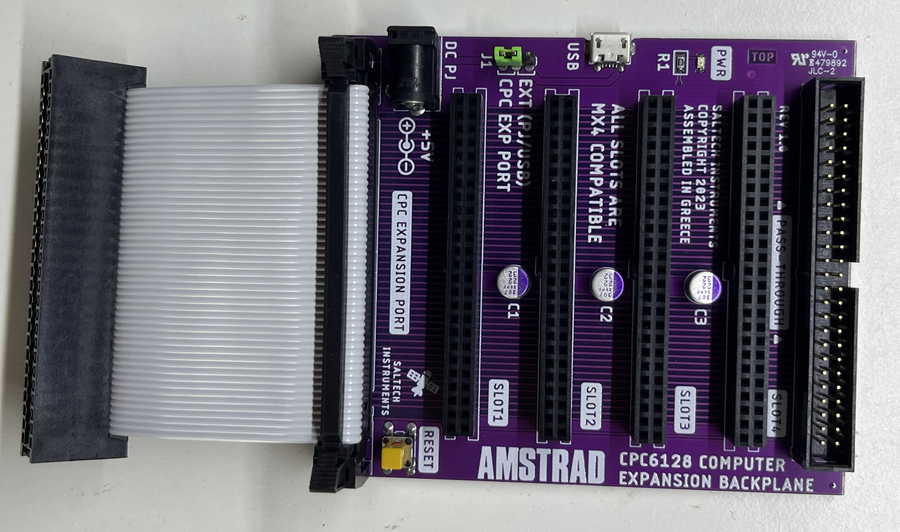
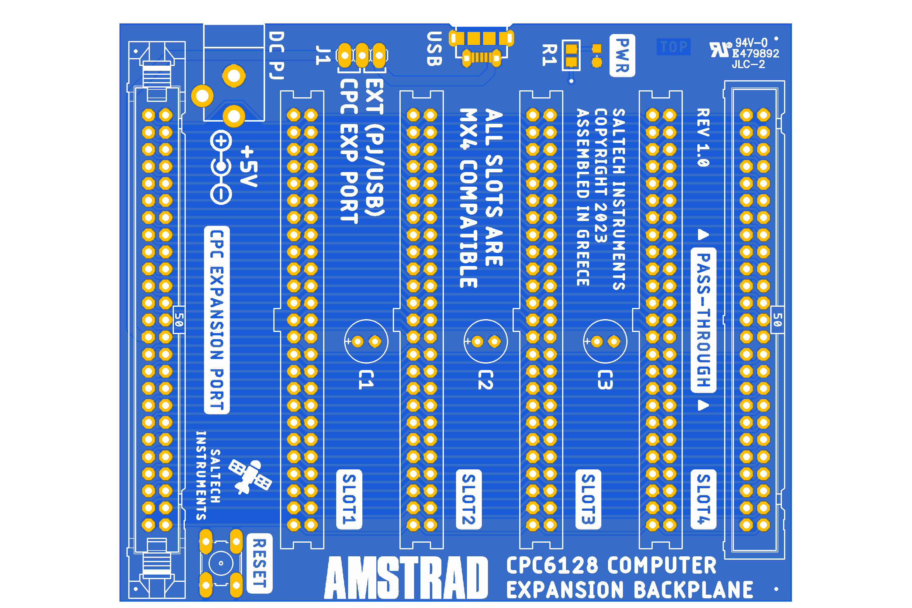

## Amstrad CPC Backplane

This in an expansion board that plugs into the 50-pin edge connector on the rear of CPC 464/664/6128/Plus computers.

It provides 4 expansion slots, allowing users to connect multiple peripherals simultaneously, such as RAM expansions, ROM boxes, or floppy emulators.

